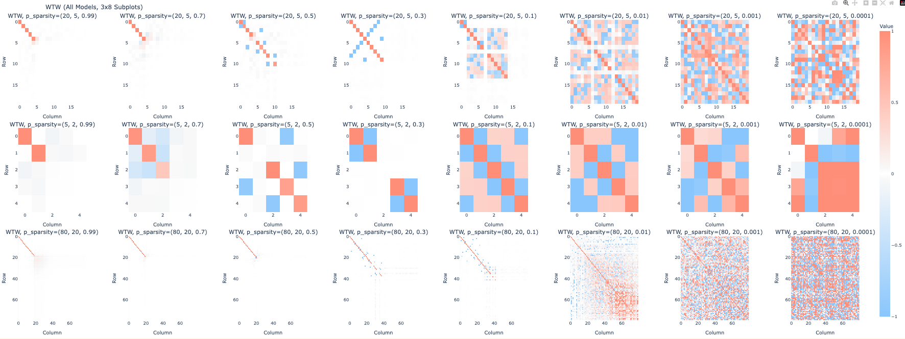
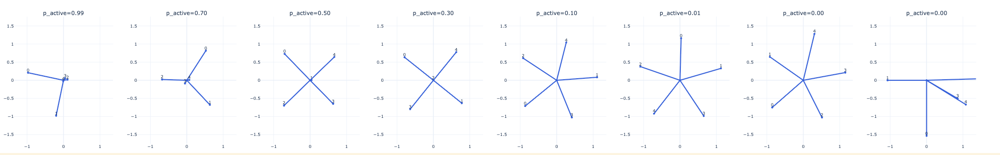

# TMOS Replication

## Plots from `TMOS.ipynb`

### Encoder W vectors (2D)

### W^T W across model settings

## Notes

- These images are static renders extracted from the Plotly outputs saved inside `TMOS.ipynb`.
- Source notebook: `TMOS.ipynb`.
